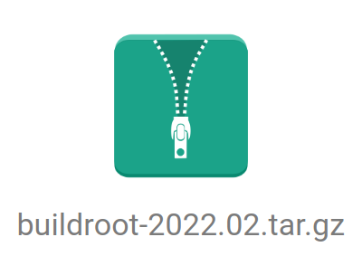

# buildroot

+ [agenda](#agenda)
+ [preparing](#preparing)
+ [download](#download)
+ [create_config_file](#create_config_file)
+ [after_make](#after_make)
+ [cross_compiling](#cross_compiling)
+ [qemu_system_arm_launch](#qemu_system_arm_launch)
+ [programm_running](#programm_running)

## agenda

Все примеры даны для версии buildroot_2022.2.

1. [preparing](#preparing);
2. [download](#download);
3. [create_config_file](#create_config_file);
4. [cross_compiling](#cross_compiling);
5. [qemu_system_arm_launch](#qemu_system_arm_launch);
6. [programm_running](#programm_running);


## preparing

### qemu arm
1. [включить виртуализацию](https://github.com/Drakonof/references/tree/main/linux/tools/qemu#preparing);
2. [установить](https://github.com/Drakonof/references/tree/main/linux/tools/qemu#installing) виртуальную машину. В частности qemu-system-arm: `sudo apt-get install qemu-system-arm`;
3. Доставить нехватающие проги из списка: which, sed, make (v.3.81 и позже), binutils, build-essential (только для Debian), gcc (v.4.8 и позже), g++ (v.4.8 и позже), bash, patch, gzip, bzip2, perl (v.5.8.7 и позже), tar, cpio, unzip, rsync, file (должен быть в /usr/bin/file), bc;
4. Доставить ncurses: `sudo apt-get install libncurses5-dev libncursesw5-dev`;

### Zynq
1. Достать схему платы;
2. Создать прошивку для PL части [TODO сылка на проект](#TODO);
3. Перад генерацией bitstream, установить галочку vivado -> settimgs -> Bitstream -> -bin_file (Это точно такой же бинарник как и bit файл, но короче , так у него отсутвует информация для jtag: имя bitstream, FPGA, user iD и тд); 

## download

[Скачать buildroot.](https://buildroot.org/download.html)



Разархивировать скачанный файл: `tar -xvzf buildroot-2022.02.tar.gz`

## create_config_file

Есть два варианта: 1. создать custom kernel and cross compiler configurations самому (если нет готовых конфигурации в списке buildroot'а); 2. использовать существующую конфигурацию из списка buildroot'а;

`make list-defconfigs` - показать списк всех существующих конфигураций;

### custom kernel and cross compiler configurations
todo

###  existing kernel and cross compiler configurations
1. Перейти в паку с buildroot;
2. Создать конфигурационный файл для платформы (.config);
3. Собрать ядро (займет много время, от получаса до полутора, двух часов); 
```
cd buildroot-2022.02
make qemu_arm_versatile_defconfig
make
```

## after_make

Появится папка output. Которая содержит: build, host, images, staging, target.

В output/images: rootfs.ext2 (рут фаловая система), versatile-pb.dtb (девайстри файл), zImage (кернел), start-qemu.sh (скрипт для запуска qemu);

В output/host: arm-buildroot-linux-uclibcgnueabi-gcc (имя кроскомпилятора), пака bin (бинарники кросскомпилятора), папка arm-buildroot-linux-uclibcgnueabi/sysroot (хэдер файлы библиотек устройства для кросскомпилятора), это bin, dev, etc, lib, lib32, media, mnt, opt, proc, root, run, sbin, sys, tmp, usr;

Для проверки кросскомпилятора: `arm-buildroot-linux-uclibcgnueabi-gcc --version` в папке с output/host.

## cross_compiling

1. Установить путь к кросскомпилятору;
2. Cобрать программму;
3. Примонтировать файловую систему устройства;
4. Передать бинарник программы в файловую систему устройства;
5. Отмонтировать файловую систему устройства;

```
Пример для hello:

PATH=$PATH:some_dir/output/host/binarm-buildroot-linux-uclibcgnueabi-gcc hello.c -o hello
sudo mount -t ext2 -o rw,loop /some_dir/rootfs.ext2 /mnt/mnt_partition_name
sudo cp hello /mnt/mnt_partition_name/root/
sudo umount mnt_partition_name
```

## qemu_system_arm_launch

Из output/images: `./start-qemu.sh` 

Логин: root

## programm_running

После запуска, загрузки и логина модно стартовать прогу.

Просто из корня, для программы hello: `./hello`